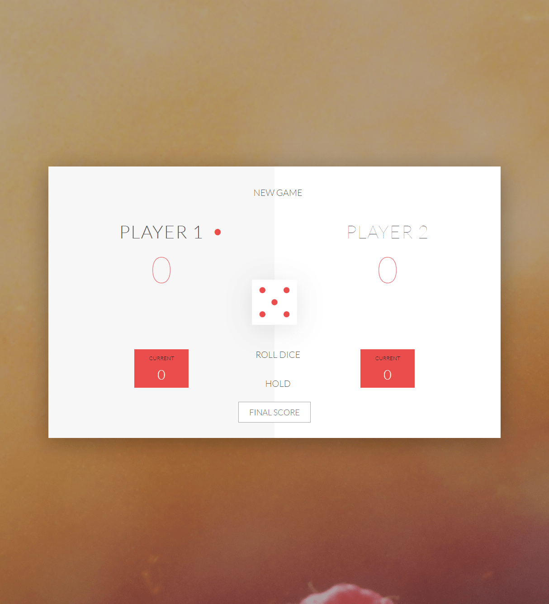

# [Dice Game](http://104.248.7.120:3006)

Dice Game made with pure JavaScript, powered by [javascript, node, express, html, css](#).

##### Try version `1.0.0-beta` using the following [link](http://104.248.7.120:3006). Thanks!

## To Install

> Before you install, please insure you have the latest version of **Node**, **NPM**, and **Git** installed on your machine.

## Building from sources

```bash
# Clone Repository
git clone https://github.com/cwooz/pig-game-js
# Install server dependencies
npm install
# Run Application
node app.js
# Build for production
cd client
npm run build
```

## Built Using

```javascript
import { JavaScript, Node, Express } from 'dependencies';
```


